---
## Front matter
title: "Лабораторная работа №7"
subtitle: "Простейший вариант выполнения лабораторной работы
"
author: "Атанесов Александр Николаевич"

## Generic otions
lang: ru-RU
toc-title: "Содержание"

## Bibliography
bibliography: bib/cite.bib
csl: pandoc/csl/gost-r-7-0-5-2008-numeric.csl

## Pdf output format
toc: true # Table of contents
toc-depth: 2
lof: true # List of figures
lot: true # List of tables
fontsize: 12pt
linestretch: 1.5
papersize: a4
documentclass: scrreprt
## I18n polyglossia
polyglossia-lang:
  name: russian
  options:
	- spelling=modern
	- babelshorthands=true
polyglossia-otherlangs:
  name: english
## I18n babel
babel-lang: russian
babel-otherlangs: english
## Fonts
mainfont: PT Serif
romanfont: PT Serif
sansfont: PT Sans
monofont: PT Mono
mainfontoptions: Ligatures=TeX
romanfontoptions: Ligatures=TeX
sansfontoptions: Ligatures=TeX,Scale=MatchLowercase
monofontoptions: Scale=MatchLowercase,Scale=0.9
## Biblatex
biblatex: true
biblio-style: "gost-numeric"
biblatexoptions:
  - parentracker=true
  - backend=biber
  - hyperref=auto
  - language=auto
  - autolang=other*
  - citestyle=gost-numeric
## Pandoc-crossref LaTeX customization
figureTitle: "Рис."
tableTitle: "Таблица"
listingTitle: "Листинг"
lofTitle: "Список иллюстраций"
lotTitle: "Список таблиц"
lolTitle: "Листинги"
## Misc options
indent: true
header-includes:
  - \usepackage{indentfirst}
  - \usepackage{float} # keep figures where there are in the text
  - \floatplacement{figure}{H} # keep figures where there are in the text
---

# Цель работы
Приобретение практических навыков взаимодействия пользователя с системой по-
средством командной строки.

# Задание

 1.Взаимодействрвать с ОС через терминал посредством команд;

# Теоретическое введение

Здесь описываются теоретические аспекты, связанные с выполнением работы.

Например, в табл. [-@tbl:std-dir] приведено краткое описание стандартных каталогов Unix.

: Описание некоторых каталогов файловой системы GNU Linux {#tbl:std-dir}

| Имя каталога | Описание каталога                                                                                                          |
|--------------|----------------------------------------------------------------------------------------------------------------------------|
| `/`          | Корневая директория, содержащая всю файловую                                                                               |
| `/bin `      | Основные системные утилиты, необходимые как в однопользовательском режиме, так и при обычной работе всем пользователям     |
| `/etc`       | Общесистемные конфигурационные файлы и файлы конфигурации установленных программ                                           |
| `/home`      | Содержит домашние директории пользователей, которые, в свою очередь, содержат персональные настройки и данные пользователя |
| `/media`     | Точки монтирования для сменных носителей                                                                                   |
| `/root`      | Домашняя директория пользователя  `root`                                                                                   |
| `/tmp`       | Временные файлы                                                                                                            |
| `/usr`       | Вторичная иерархия для данных пользователя                                                                                 |

Более подробно об Unix см. в [@gnu-doc:bash;@newham:2005:bash;@zarrelli:2017:bash;@robbins:2013:bash;@tannenbaum:arch-pc:ru;@tannenbaum:modern-os:ru].

# Выполнение лабораторной работы

1. Изучаю информацию о команде mc. (рис. [-@fig:001])

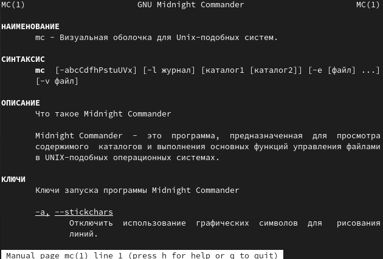{#fig:001 width=90%}

##

2. Открываю Midnight Commander. (рис. [-@fig:002])

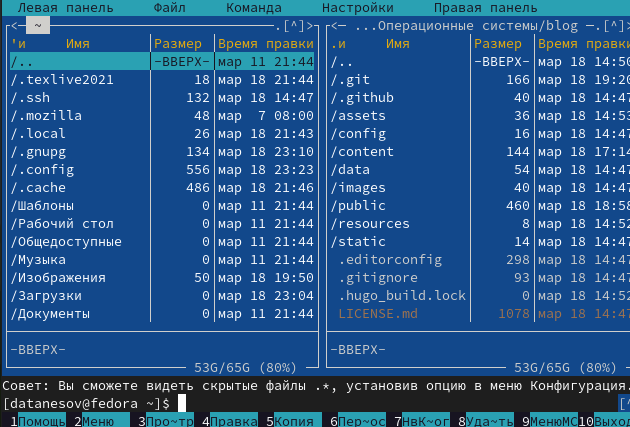{#fig:002 width=90%}

##

3. Выполняю операции со вкладкой Файл. (рис. [-@fig:003])

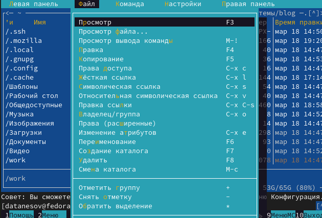{#fig:003 width=90%}

##

4. Открываю для просмотра текстовой файл conf.txt. (рис. [-@fig:004]) 

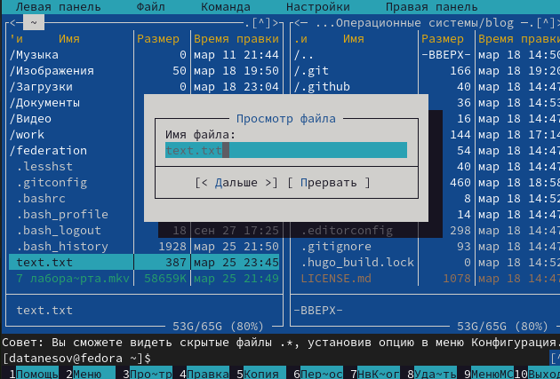{#fig:004 width=90%}

##

5. Просматриваю содержимое. (рис. [-@fig:005])

{#fig:005 width=90%}

##

6. Собираюсь менять содержимое файла. (рис. [-@fig:006])

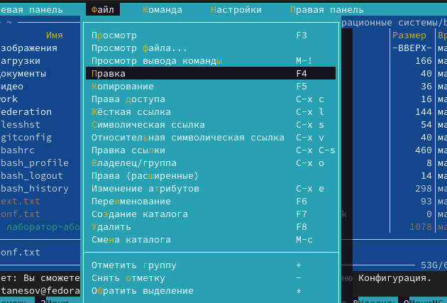{#fig:006 width=90%}

##

7. Создаю каталог . (рис. [-@fig:007])

{#fig:007 width=90%}

##

8. Копирую файл в созданный каталог . (рис. [-@fig:008])

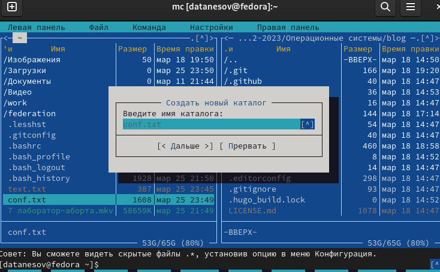{#fig:008 width=90%}

##

9. Провожу поиск в файловой системе по заданным условиям . (рис. [-@fig:009])

{#fig:009 width=90%}

##

10.просматриваю последнюю команду. (рис. [-@fig:010])

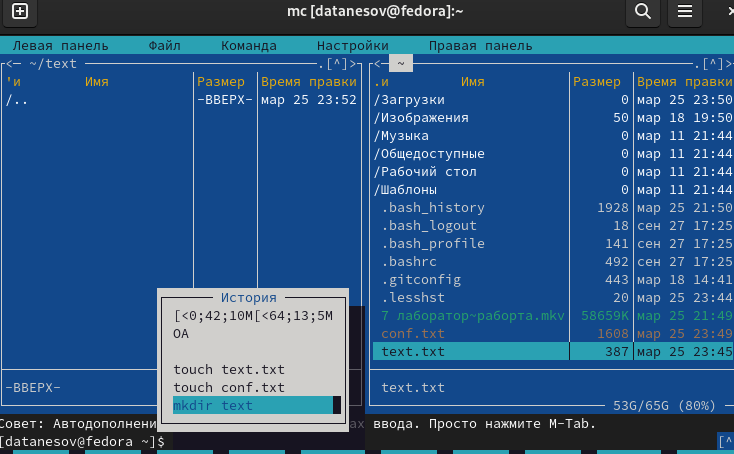{#fig:010 width=90%}

##

11. Перехожу в домашнюю директорию . (рис. [-@fig:011])

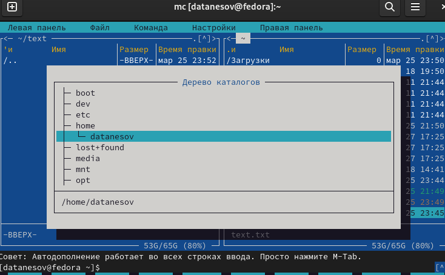{#fig:011 width=90%}

##

12. Анализ файла меню. (рис. [-@fig:012])

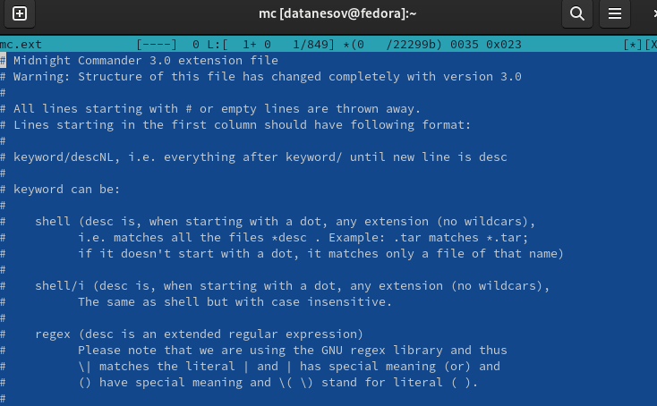{#fig:012 width=90%}

##

13. Анализ файла расширений. (рис. [-@fig:013])

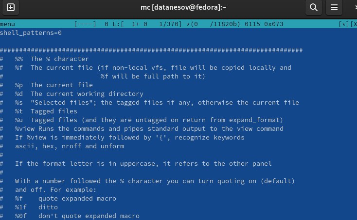{#fig:013 width=90%}

##

14. Осваивание операции определения стуктуры экрана MC. (рис. [-@fig:014])

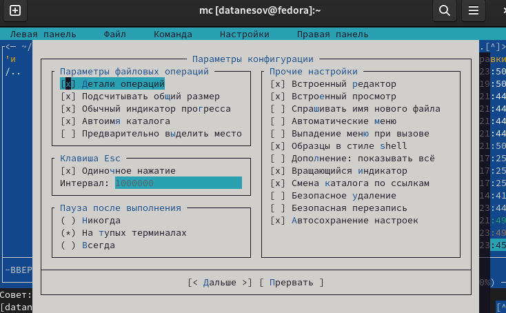(image/13.png){#fig:014 width=90%}

##

15. Осваивание операции определения стуктуры экрана MC. (рис. [-@fig:015])

{#fig:015 width=90%}

##

16. Создаю файл text.txt. (рис. [-@fig:016])

{#fig:016 width=90%}(image/18.png){#fig:018 width=90%}

##

17. Открываю файл с помощью редактора MC. (рис. [-@fig:017])

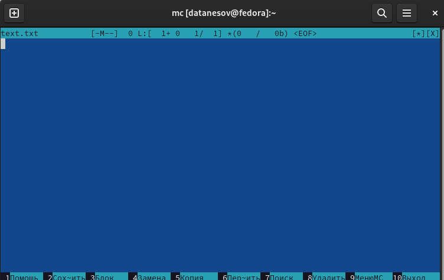{#fig:017 width=90%}

##

18. Вставляю текст. (рис. [-@fig:018])

{#fig:018 width=90%}

##

19. Удаляю одну строчку текста. (рис. [-@fig:019])

{#fig:019 width=90%}

##

20. Копирую строчку. (рис. [-@fig:020])

{#fig:020 width=90%}

##

21. Сохраняю файл. (рис. [-@fig:021])

{#fig:021 width=90%}

##

22. Отменяю последнее действие. (рис. [-@fig:022])

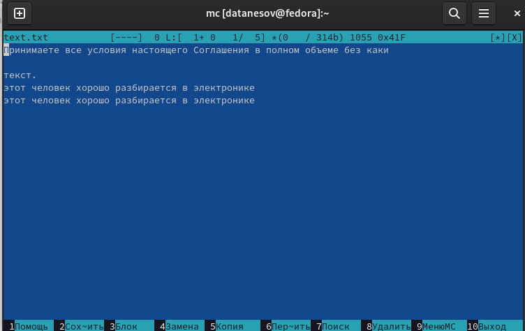{#fig:022 width=90%}

##

23. Перехожу в конец файла . (рис. [-@fig:023])

{#fig:023 width=90%}

##

24. Перехожу в конец файла . (рис. [-@fig:024])

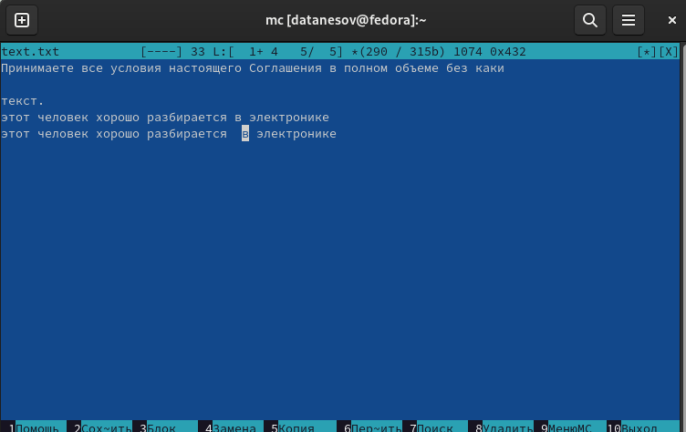{#fig:024 width=90%}

##

25. Сохраняю файл. (рис. [-@fig:025])

{#fig:025 width=90%}

##

26. Открываю файл и включаю подсветку синтаксиса. (рис. [-@fig:026])

{#fig:026 width=90%}

# Выводы

- Познал функции программы Midnighht Commander
# Ответы на контрольные вопросы

- 1. В Midnight Commander (mc) есть два основных режима работы: режим файлового менеджера и режим редактирования текста. Режим файлового менеджера позволяет пользователю просматривать и управлять файлами и каталогами, выполняя такие операции, как копирование, перемещение, удаление, создание, архивирование и прочее. Режим редактирования текста используется для просмотра и редактирования текстовых файлов. В нем можно выполнять такие операции, как поиск и замена текста, перемещение курсора, вставка/удаление символов и строки, выбор блоков текста и многое другое.

- 2. В Midnight Commander можно выполнить множество операций с файлами с помощью команд shell или с помощью меню. Например, можно скопировать файл, используя команду "cp" в shell или выбрав файл и нажав клавишу "F5" в меню. Также можно удалить файл с помощью команды "rm" в shell или используя комбинацию клавиш "F8" в меню. Еще один пример - перемещение файла с помощью команды "mv" в shell или нажатием клавиши "F6" в меню.

- 3. Левая панель меню Midnight Commander содержит список файлов и каталогов текущего каталога, расположенного в левой части экрана. В меню доступны команды для навигации в каталогах, копирования, перемещения, удаления и других операций с файлами.

- 4. Меню Файл содержит команды для создания и удаления файлов и каталогов, переименования, изменения прав доступа, архивирования и др.

- 5. Меню Команда позволяет выполнять различные действия над файлами и каталогами, например, редактирование текстовых файлов, поиск и замена текста, просмотр и редактирование атрибутов файлов и т.д.

- 6. Меню Настройки позволяет настроить различные параметры Midnight Commander, такие как внешний вид, формат отображения файлов, языковые настройки, настройки главного меню и многие другие параметры.

- 7. Некоторые встроенные команды Midnight Commander:
- Переместить файл (F6)
- Скопировать файл (F5)
- Удалить файл (F8)
- Создать каталог (F7)
- Архивировать файлы (F2)
- Распаковать архив (Alt+Enter)

- 8. Некоторые команды встроенного редактора Midnight Commander:
- Сохранить файл (Ctrl+S)
- Выйти из редактора (F10)
- Выбрать весь текст (Ctrl+A)
- Вырезать выбранный текст (Ctrl+X)
- Копировать выбранный текст (Ctrl+C)
- Вставить текст из буфера обмена (Ctrl+V)

- 9. В Midnight Commander можно создавать пользовательские меню, которые позволяют пользователю выполнять свои собственные команды и скрипты. Для этого нужно выбрать "Вставить меню" из меню "Файл" и создать новый элемент меню, добавив команду или скрипт.

- 10. Midnight Commander имеет ряд средств для выполнения действий, определяемых пользователем, над текущим файлом, таких как просмотр и редактирование атрибутов файла, копирование пути к файлу в буфер обмена, поиск и замена текста в файле, анализ размера и содержимого файла и многие другие.

# Список литературы{.unnumbered}

::: {#refs}
:::
